# Financial_Transaction_Application-Docker_project

----------------------------------------------------------------------------------------------------------

Le projet repose sur l'architecture suivante :

- **Spring Boot App** (PayMyBuddy) : application Java backend.
- **MySQL** : base de données relationnelle.
- **Docker** : conteneurisation des services.
- **Docker Compose** : orchestration multi-conteneurs.
- **Docker Registry** : registre privé pour héberger les images Docker.
- **Docker Registry UI** : interface web pour consulter les images du registre.
- **Réseau Docker personnalisé** : permet la communication entre les conteneurs du projet.

Les services sont déployés ensemble grâce à Docker Compose pour permettre un environnement de développement ou de production isolé, reproductible et portable.

Voici la liste des commandes a utilisé:

- git clone https://github.com/MaximeLanca/Financial_Transaction_Application-Docker_project.git
- cd Financial_Transaction_Application-Docker_project
- docker-compose up -d
- docker images (pour vérification)
- docker network create paymybuddy-network
- docker run -d -p 5000:5000 --net paymybuddy-network --name paymybuddy-registry -e REGISTRY_STORAGE_DELETE_ENABLED=true registry:2
- docker run -d -p 8081:80 --net paymybuddy-network --name paymybuddy-frontend -e REGISTRY_URL=http://paymybuddy-registry:5000 -e REGISTRY_TITLE=PayMyBuddyRegistry joxit/docker-registry-ui:1.5-static
- docker tag financial_transaction_application-docker_project-paymybuddy-backend:latest localhost:5000/paymybuddy-backend:local
- docker tag mysql:8.0 localhost:5000/paymybuddy-db:local
- docker push localhost:5000/paymybuddy-backend:local
- docker push localhost:5000/paymybuddy-db:local 
- curl -X GET http://localhost:5000/v2/_catalog

Description de la stack:

### Etape 1 
Copier le lien HTTPS du répository https://github.com/MaximeLanca/Financial_Transaction_Application-Docker_project.git

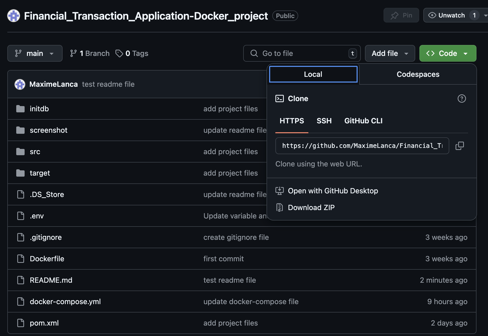

### Etape 2 
Aller sur le repertoire suivant: /root/Financial_Transaction_Application-Docker_project.

### Etape 3 
Ce répertoire comporte trois fichiers importants pour la containerisation:
-le fichier .env
-le fichier Dockerfile
-le fichier docker-compose.yml
Ces trois fichiers sont deja remplis dans le repository.
Je décris juste les 3 prochaines etapes.

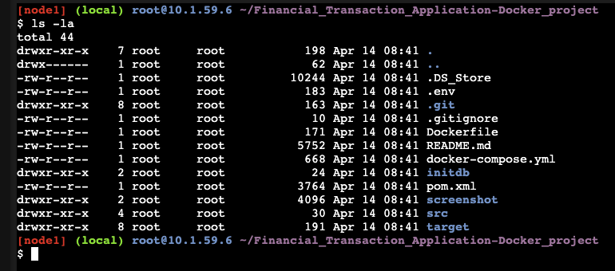

### Etape 4 
J'ai crée Le fichier .env pour contenir les variables d'environnement suivant: 
MYSQL_USER=paymybuddy_user \
MYSQL_PASSWORD=supermotdepasse \
MYSQL_DATABASE=paymybuddy \
SPRING_DATASOURCE_URL=jdbc:mysql://paymybuddy-db:3306/paymybuddy \
MYSQL_ROOT_PASSWORD=rootpassword

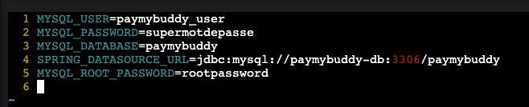
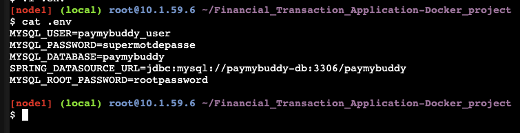

### Etape 5 
J'ai completé le Dockerfile pour builder l’application de cette façon:
FROM amazoncorretto:17-alpine \
LABEL maintainer="Maxime Lanca" \
VOLUME /data \
COPY target/paymybuddy.jar /paymybuddy.jar \
EXPOSE 8080 \
CMD ["java", "-jar", "/paymybuddy.jar"] \

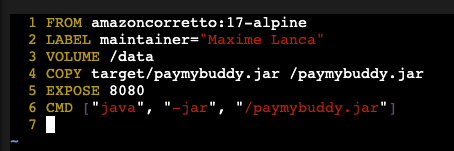

### Etape 6 
J'ai completé le fichier docker-compose.yml avec les élements suivant::
version: '3.8' \
services: \
  paymybuddy-backend: \
    build: . \
    ports: \
      - "8080:8080" \
    environment: \
      - SPRING_DATASOURCE_URL=${SPRING_DATASOURCE_URL} \
      - SPRING_DATASOURCE_USERNAME=${MYSQL_USER} \
      - SPRING_DATASOURCE_PASSWORD=${MYSQL_PASSWORD} \
    depends_on: \
      - paymybuddy-db 

  paymybuddy-db: \
    image: mysql:8.0 \
    environment: \
	- MYSQL_ROOT_PASSWORD=${MYSQL_ROOR_PASSWORD} \
	- MYSQL_DATABASE=${MYSQL_DATABASE} \
    	- MYSQL_USER=${MYSQL_USER} \
    	- MYSQL_PASSWORD=${MYSQL_PASSWORD} \
    volumes: \
      - db_data:/var/lib/mysql \
      - ./initdb:/docker-entrypoint-initdb.d \
    ports: \
      - "3306:3306" 

volumes: \
  db_data:

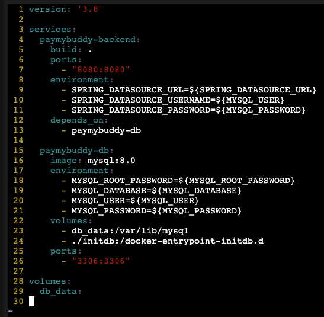

### Etape 7 
Depuis le dossier contenant le docker-compose.yml, on execute : docker-compose up -d. Cela va construire les images et lancer les conteneurs.

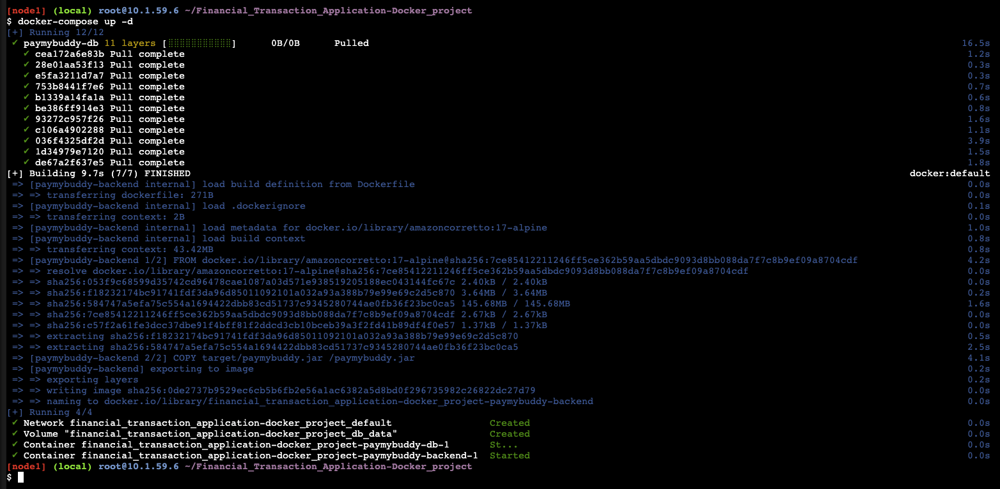

### Etape 8 
Vérifier que tout fonctionne avec : docker images.

### Etape 9 
Créer un réseau Docker pour connecter les services: docker network create paymybuddy-network et faire lancer docker network ls pour vérifier la création du réseau.

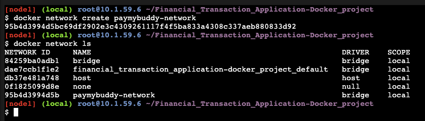

### Etape 10 
Lancer un registre privé: docker run -d -p 5000:5000 --net paymybuddy-network --name paymybuddy-registry -e REGISTRY_STORAGE_DELETE_ENABLED=true registry:2

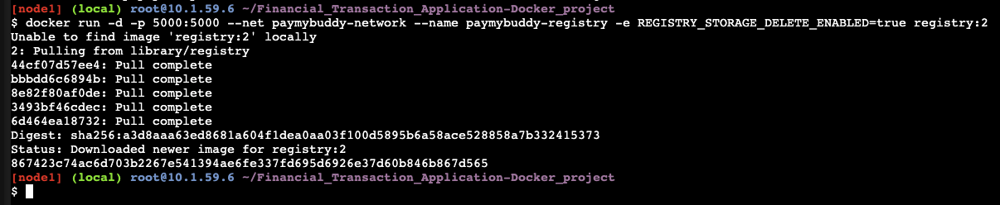

### Etape 11 
Lancer l'interface web du registre: docker run -d -p 8081:80 --net paymybuddy-network --name paymybuddy-frontend \
  -e REGISTRY_URL=http://paymybuddy-registry:5000 \
  -e REGISTRY_TITLE=PayMyBuddyRegistry \
  joxit/docker-registry-ui:1.5-static

### Etape 12 
Vérification des conteneurs et des images avec docker images et docker ps.

### Etape 13 
Taguer les images "financial_transaction_application-docker_project-paymybuddy-backend" et "mysql" par "localhost:5000/paymybuddy-backend:local" et "localhost:5000/paymybuddy-db:local" avec docker tag.

### Etape 14 
On envoie les images dans le repository en lancant docker push sur les deux images taguées.

### Etape 15 
J'ai toujours un problème avec le registre privé qui m'empeche de montrer les images chargés en allant dans le port dédié.

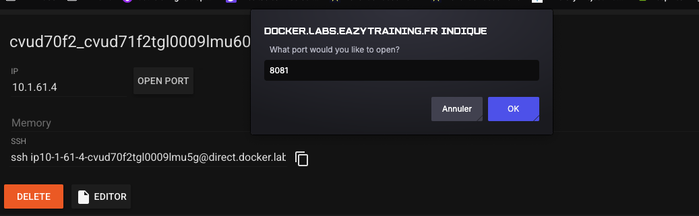

On peut quand meme vérifier la validation des envoies dans le repository avec la commande "curl -X GET http://localhost:5000/v2/_catalog".
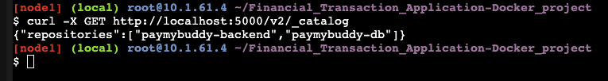

